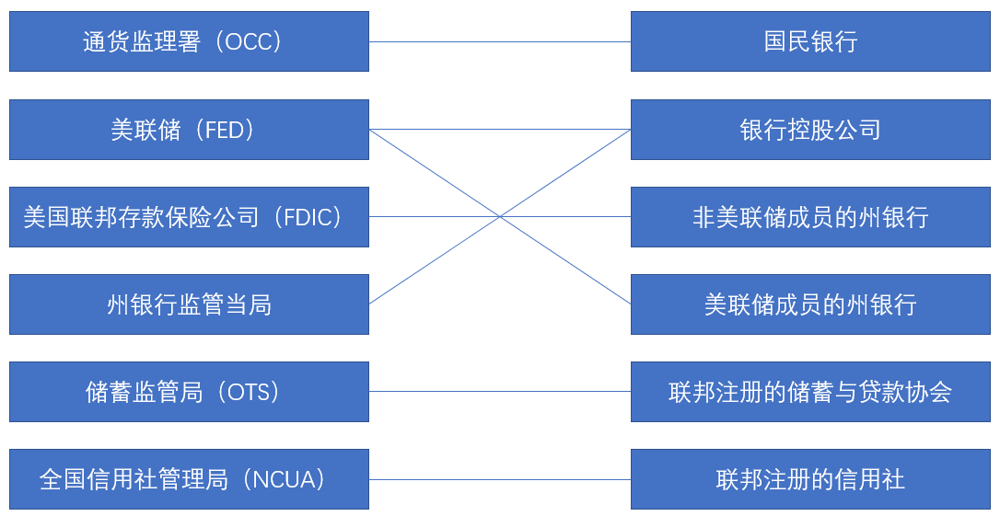

这一章主要讲述银行业结构以及结构的演化。

### 1. 美国银行的多重监管喻双重银行体系（dual banking system）

由于一些历史原因，美国银行有多重监管以及双重银行体系（dual banking system），即银行要接受中央银行和州政府的监管。

### 2. 美国商业银行业结构

* **《麦克法登法案》**禁止银行跨周开办分支结构。银行业使用银行持股公司、自动提款机进行规避。
* **《格拉斯-斯蒂格尔法案》**禁止商业银行承销&发行企业证券，即分割投资银行和商业银行。
* **《里格尼尔州际银行业务喻分支机构效率法案》**（1994）允许州际分支机构。
* **《格兰姆-里奇-布利利金融服务现代化法案》**废除格拉斯法案

### 3. 金融创新与影子银行

* 利率波动导致需求变化：可变利率抵押贷款，金融衍生工具。
* 适应供给的信息技术：信用卡与借记卡、电子银行业务、垃圾债券、商业票据市场。
* 证券化与影子银行：
  * 发起贷款；
  * 贷款服务；
  * 捆绑；
  * 分销；
* 规避监管的金融创新：货币市场共同基金、流动账户。
* 金融创新导致传统银行业的衰落。

### 4. 一些其他金融结构

* 储蓄与贷款协会；

* 信用社；
* 美国海外银行业务（欧洲美元市场）；
* 美国的外国银行。