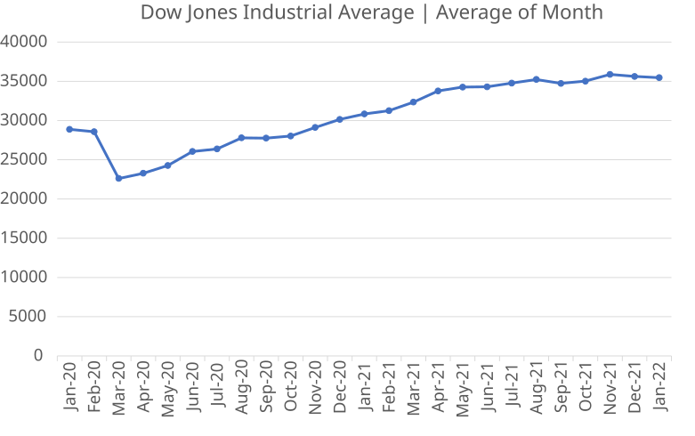
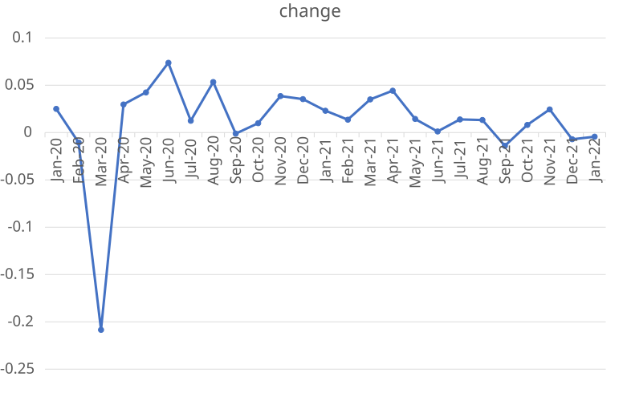

疫情之后的道琼斯工业指数

道琼斯工业指数的增长率

数据整理：[google文档](https://docs.google.com/spreadsheets/d/18S3EzF0Y8Eh9YCAfCt7UznUlV83Ndhox/edit?usp=sharing&ouid=116628198958200984504&rtpof=true&sd=true)

数据来源：[Financial Forecast Center](https://www.forecasts.org/)
