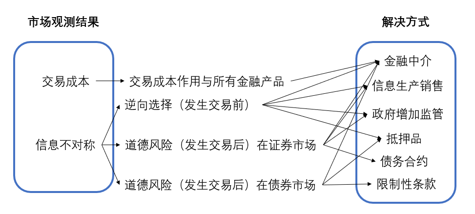

### 1. 金融结构的8个基本事实

1. 股票不是企业最主要的外部融资来源；
2. 可流通债券不是企业主要外部融资来源；
3. 间接融资重要性大于直接融资；
4. 金融中介，特别是银行，是企业外部资金的重要来源（类似3）
5. 金融体系是经济体中收到监管最严格的部门；
6. 只有良好信誉的大公司才能进入金融市场筹资；

7. 债务合约通常需要抵押品（显性和隐性抵押品）；
8. 债务合约有繁复的限制条款和法律文件；

### 2. 理论架构

这一章的结构非常复杂，因此先说明一些概念的关系。

### 3. 交易成本

**问题**：每一笔交易成本几乎固定，因此小笔交易相对的成本更高。

**解决办法**：

1. 规模经济。将投资者的钱聚集在一起进行投资。
2. 专业技术和服务。金融机构可以使用专业的技术和硬件进行投资，可以拉低每一笔交易的成本。

### 4. 逆向选择作用与金融市场

**问题**：差公司相比好公司有更强的意愿去发行相同利息的债券。

**解决办法**：

1. 信息生产和出售（会存在免费搭车者）；
2. 政府增加监管；
3. 金融中介手机信息并且发放私人贷款（私人贷款无法交易，因此不会出现免费搭车者问题）；
4. 抵押品。

### 5. 道德风险作用股权合约

**问题（委托-代理问题）**：经理比股东有更多信息和实时掌握公司的权力并且经理和股东的利益不一定符合，因此会在决策时以自己的利益为主。

**解决办法**：

1. 信息产生和出售（免费搭车者）；
2. 政府监管；
3. 金融中介收集信息且股权不可转让；
4. 使用债务合约。在公司获利时不追问经营细节，在亏损时可以通过法律索取利益。

### 6. 道德风险作用债务合约

**问题**：借款人利用信息不对称可能从事风险更高的活动，因为如果盈利将获得更大的利润。

**解决办法**：

1. 抵押品（或者让公司有更高的净值来弥补可能会出现的亏损）；
2. 限制性条款：限制借款人违背贷款人利益的行为；强制借款人执行符合贷款人利益的行为（购买人寿保险）；保持抵押品的价值；提供信息。（这种解决办法会引入执行成本的问题）
3. 金融中介：降低执行成本。

