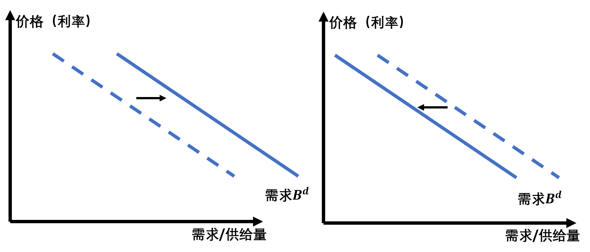

### 0. 一些理解

根据《货币经济学》和理论上的推理，利率并不是由美联储决定的。市场上的利率会根据美联储的货币政策改变（例如货币供给量），但是市场上的利率是交易者的决策决定的，利率行为就是分析利率如何被决定的。总的来说有两种理论来解释利率的变化：

1. **投资组合选择理论**

2. **流动性偏好理论**

### 1. 投资组合选择理论

#### 1.1 基本假设

* 财富上升，则对债券需求数量上升
* 债券预期回报率（不是到期回报率，不是利率）上升，对债券需求数量上升
* 债券风险上升，对债券需求数量下降
* 债券流动性上升，对占全需求数量上升

#### 1.2 债券需求供给曲线（以一年期贴现放行债券为例）

其他条件不变情况下：债券价格越低需求量越高

其他条件不变情况下：债券价格越高供给量越高

**说明**：这里说的债券价格是对于固定面值（par value/face value）的债券。例如面值为1000元的债券，一年后将偿付1000元，这里的价格是买这个特定1000元债券的价格

根据上面所述的情况，可以画出债券的供需曲线，如下：

在这个图中，纵坐标为债券的价格，同时可以衡量对于该债券的利率，因为利率和债券的价格成负相关。以一年期贴现发行的债券为例，利率$i = (F - P) / P$，其中$F$表示债券的面值，$P$表示债券现在的价格。

要注意不同术语的表达方式。此处的**利率**表示已经在市场上的利率。

**预期利率**是人们觉得之后的利率，如果预期利率上升，说明人们觉得之后债券的价格会下跌。

**预期回报率**在这里可以理解为债券价值的变化率，也就是说预期回报率和债券的价格正相关。我认为不能像《货币金融学》把预期回报率和利率挂钩，最好把其当作不相关的变量。对于一年期的债券如果持有时间就是一年，那么预期回报率是不变，这也就是《货币金融学》中的观点。但是在分析供需的时候，应该认为持有者会在短期内卖掉债券，也就是只赚取债券价格变化中的差价。这也就是说，如果预期利率上升，那么预期回报率就下跌，即投资者认为以后债券价格会下跌。

#### 1.3 需求曲线的位移

下面表中显示了债券需求量变化的影响因素。

| 影响因素              | 变化 | 需求量变化 |
| --------------------- | ---- | ---------- |
| 财富                  | 上升 | 上升       |
| 债券预期利率（见1.2） | 上升 | 下降       |
| 预期通货膨胀          | 上升 | 下降       |
| 债券风险              | 上升 | 下降       |
| 债券流动性            | 上升 | 上升       |

需求量变化的导致需求曲线变化的情况如下：

#### 1.4 供给曲线分析

下表中显示了供给曲线的影响因素：

| 影响因素             | 变化 | 供给变化 |
| -------------------- | ---- | -------- |
| （对公司）预期盈利性 | 上升 | 上升     |
| 预期通货膨胀         | 上升 | 上升     |
| 政府赤字             | 上升 | 上升     |

### 2. 流动性偏好理论

#### 2.1 基本假设

假定市场只有货币（$M$)和债券（$B$）两种资产

那么货币的供给（$M^s$）和债券供给（$B^s$）之和一定等于货币需求（$M^d$）和债券需求（$B^d$）之和，用公式表示如下：
$$
M^s + B^s = M^d + B^d\\\\
B^s - B^d = M^d - M^s
$$
根据货币的供需就可以推导出债券的供需情况。在货币的供需关系中，货币的价格可以理解为持有货币的成本，也就是利率越高持有货币的成本越高。在理想情况下（只考虑M1货币）货币的供给是固定的。

#### 2.2 供需曲线位移

影响供需曲线的因素如下：

| 影响因素         | 变化 | 供需变化  |
| ---------------- | ---- | --------- |
| 收入（效应）     | 上升 | $M^d$上升 |
| 价格（效应）     | 上升 | $M^d$上升 |
| 货币供给         | 上升 | $M^s$上升 |
| 通货膨胀（效应） | 上升 | $M^d$上升 |

