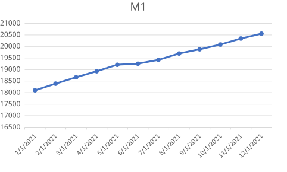
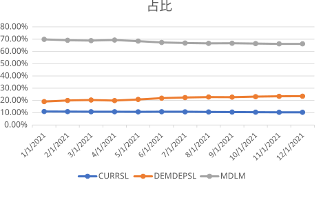

### 1. 概念

* 定义货币：在产品和服务支付以及债务偿还中被普遍接受的东西
* 货币的功能：交易媒介、记账单位、价值储存
* 支付体系的演进：商品货币、不兑现纸币、支票、电子支付、电子货币
* 货币的计量：

**M1**：通货（currency）、支票账户存款、旅行者支票、其他支票存款

**M2**：M1、小额定期存款、储蓄存款与货币市场账户、货币市场共同基金

### 2. M1和M2货币数量

#### 2.1 M1

M1的构成为通货、支票账户存款、旅行者支票、其他支票存款。这是《货币金融学》里面标准的定义，在之后的金融技术革新之后，其他支票存款被替换成了其他流动性存款（Other Liquidity Deposits）；此外美联储在之后公布的M1里面去掉了旅行者支票（本身占比就非常小，而且逐年递减）。

根据实际情况进行调整之后M1的组成如下：

* 通货（CURRSL）
* 活期存款（DEMDEPSL）
* 其他流动性存款（MDLM）

计算出来2021年的M1如下（单位billion，十亿美元）：

上述三种组成在M1中的占比如下：

