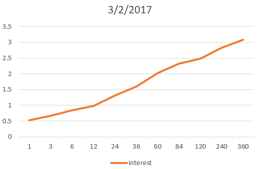
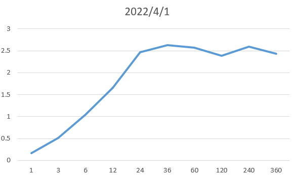
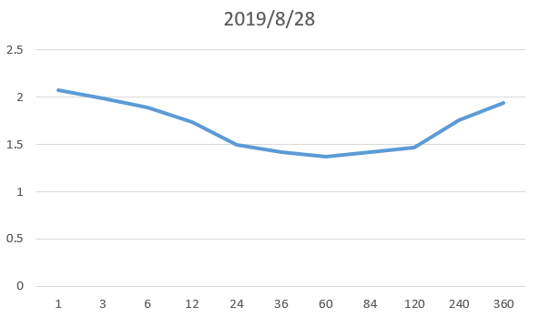

### 1. 风险结构

风险结构是为了解释为什么不同的机构发行的相同到期期限的债券利率不同。

1. 违约风险（default risk）：该风险是指债券的借款人可能违约，因此不同的程度的违约可能性会产生风险溢价。该溢价是针对国债而言，国债被视为无违约风险债券（default-free bonds）；
2. 流动性：流动性越低风险溢价越高·；
3. 所得税因素：可能针对地方债券的收入不缴纳所得税，因此地方债券利率更低。

### 2. 利率期限结构

期限结构是为了解释同一机构发行的不同时长的债券的利率不同。

#### 2.1 期限结构特点

这些不同时长的债券的利率会表现出如下三种特点：

1. 到期期限不同的债券利率随时间波动基本一致；
2. 若短期利率较低，收益率曲线（yield curve）向上倾斜；若短期利率较高，则收益率曲线可能向下倾斜；
3. 收益率曲线几乎总是向上倾斜的。

为了解释上面这三种现象，金融学家提出了三种理论。

#### 2.2 预期理论

**两个假设**：

1. 长期债券的利率等于在其有效期内预期短期利率的平均值（可以看成积分之后除以积分区间长度）；

2. 投资者对不同到期期限的债券无特别偏好。

根据上面两个假设可以计算长期利率$i_l$和短期利率$i_s$之间的关系，如下（用连续形式表示）：

$$
i_l = \int_0^T i_s(t) dt / T
$$

这个理论只能解释1、2两个特点。

#### 2.3 分割市场理论

**两个假设**：

1. 不同到期期限的债券之间不能相互替换
2. 风险厌恶这愿意持有短期的债券

根据这两个假设推理出来的结论就是第三个特点。

#### 2.4 流动性溢价理论

该理论提出的**假设**为，长期债券的利率等于两项之和：

第一项：短期利率的平均值；

第二项：流动性溢价（随到期期限$n$的增长而上升）

那么长期利率和短期利率之间的关系如下：
$$
i_l = \int_0^T i_s(t) dt / T + l_T
$$
其中$l_T$为流动性溢价。

### 3. 收益率曲线（yield Curve）

#### 3.1 定义

收益率曲线是同一时间下不同到期时间的债券的利率组成的曲线。例如下图中的收益率曲线就表示了2017年3月2日的收益率曲线。其中纵坐标表示债券到期的时长，以月为单位。

#### 3.2 收益曲线反转

在《货币金融学》中并没有详细说明反转的收益曲线对市场的影响，但是在写这博客的时候正好遇上了收益率曲线反转的情况（在2022年4月1号），反转的情况如下图。

之所以会出现这样的情况是因为投资者认为长期的利率会下降，也就是说在未来几年中利率会比现在的利率低。根据历史经验来讲，每当出现这种情况很大概率经济会发生萧条。根据统计，过去11次萧条中有10次都在萧条前出现过收益曲线反转。离谱的是在2019年8月28日出现了收益率曲线反转（见下图），过了半年之后就出现了疫情造成的萧条，理性来讲在2019年8月应该没有人知道疫情的影响，但是收益率曲线还是准确的预测了萧条的发生。

具体为什么收益率曲线反转会导致萧条我还不清楚，可以之后研究一下。

